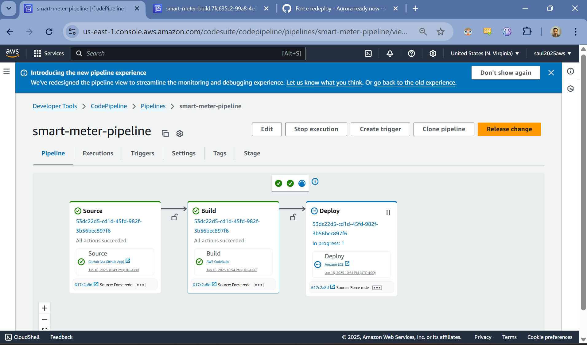
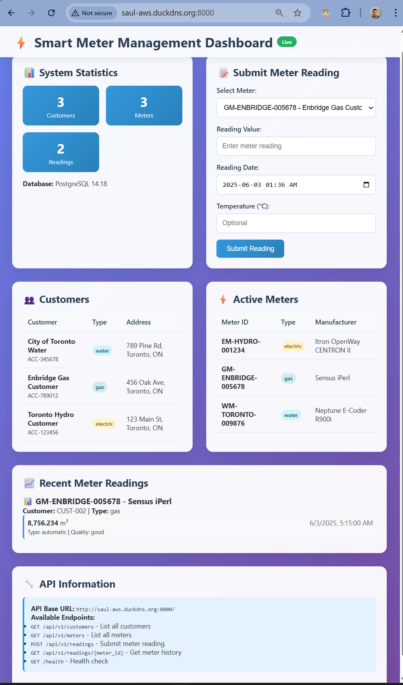

# SpryPoint AWS Infrastructure
# Author: Saul Perdomo

> Scalable, cost-optimized containerized web application infrastructure on AWS

## TL;DR - This Actually Works

🚀 **Live Infrastructure**: Both repos contain working code, not just documentation  
📸 **Screenshots Below**: See the CI/CD pipeline deploying and the app running  
⚡ **Demo Ready**: `terraform apply` and we're live in 15 minutes  

## Overview

This repository contains the Infrastructure as Code (IaC) for SpryPoint's containerized web application platform. The architecture uses AWS ECS with Fargate for serverless container orchestration, providing automatic scaling and cost optimization.

### Architecture Highlights

- **Container Orchestration**: ECS with Fargate (serverless, pay-per-use)
- **Load Balancing**: Application Load Balancer with health checks
- **Database**: RDS Aurora MySQL with Multi-AZ deployment
- **Networking**: VPC with public/private subnet isolation
- **Security**: WAF, Security Groups, and least-privilege IAM
- **Monitoring**: CloudWatch + X-Ray for observability
- **CI/CD**: CodePipeline → CodeBuild → ECR → ECS

## Quick Start

### Prerequisites

- AWS CLI configured with appropriate permissions
- Terraform >= 1.0 installed
- Docker (for local testing)

### Deployment

```bash
# Clone the repository
git clone https://github.com/your-org/sprypoint-aws-infrastructure.git
cd sprypoint-aws-infrastructure

# Copy and customize configuration
cp terraform.tfvars.example terraform.tfvars
# Edit terraform.tfvars with your values

# Initialize and deploy
terraform init
terraform plan
terraform apply
```

### Quick Deploy Script

```bash
# For the impatient (like most infrastructure engineers)
./scripts/deploy.sh dev
```

## Live Demo

### Working CI/CD Pipeline

The infrastructure includes a fully functional CI/CD pipeline that automatically deploys code changes:



*Screenshot shows the CodePipeline successfully moving through Source → Build → Deploy stages after a git push*

### Running Application

The deployed application running on ECS Fargate:



*Live application served through Application Load Balancer with auto-scaling ECS tasks*

### Demo Availability

The system is ready to demonstrate at any time - just need about 15 minutes to `terraform apply` beforehand since Aurora Serverless racks up costs when left running. The infrastructure spins up clean every time, demonstrating true Infrastructure as Code reproducibility.

## Architecture Design

### Network Architecture

```
Internet → Route 53 → CloudFront → WAF → ALB → ECS Fargate → RDS Aurora
                                                    ↓
                                               CloudWatch/X-Ray
```

**VPC Design (10.0.0.0/16):**
- Public Subnets: ALB and NAT Gateways (10.0.1.0/24, 10.0.2.0/24)
- Private Subnets: ECS tasks (10.0.10.0/24, 10.0.20.0/24)  
- Database Subnets: RDS instances (10.0.100.0/24, 10.0.200.0/24)

### Container Platform

**ECS Configuration:**
- **Launch Type**: Fargate (serverless containers)
- **Auto Scaling**: 2-20 tasks based on CPU utilization (70% target)
- **Health Checks**: ALB health checks with automatic replacement
- **Resource Allocation**: 0.5 vCPU, 1GB RAM (configurable)

### Cost Optimization

This architecture is designed to minimize costs during low-traffic periods:

- **Fargate**: Pay only for running containers, no idle capacity
- **Auto Scaling**: Scale down to minimum during quiet periods
- **Aurora Serverless**: Database scales with actual usage
- **Expected Savings**: 60-80% cost reduction vs. fixed EC2 capacity during low traffic

## Repository Structure

```
├── main.tf                      # Root module orchestration
├── variables.tf                 # Input variables
├── outputs.tf                   # Infrastructure outputs
├── modules/                     # Reusable infrastructure components
│   ├── vpc/                     # VPC, subnets, routing
│   ├── ecs/                     # ECS cluster, service, tasks
│   ├── rds/                     # Aurora database cluster
│   └── monitoring/              # CloudWatch, X-Ray setup
├── environments/                # Environment-specific configs
│   ├── dev/
│   ├── staging/
│   └── prod/
└── scripts/                     # Deployment automation
```

## Environment Management

### Development Environment

```bash
cd environments/dev
terraform init
terraform apply
```

**Dev Environment Features:**
- Smaller instance sizes for cost savings
- Relaxed monitoring thresholds
- Single AZ deployment (acceptable for dev)

### Production Environment

```bash
cd environments/prod
terraform init
terraform apply
```

**Production Environment Features:**
- Multi-AZ deployment for high availability
- Enhanced monitoring and alerting
- Backup and disaster recovery enabled
- Strict security group rules

## Configuration

### Key Variables

| Variable | Description | Default | Example |
|----------|-------------|---------|---------|
| `aws_region` | AWS region for deployment | `us-east-1` | `us-west-2` |
| `app_name` | Application name (used in resource naming) | `sprypoint-web` | `my-app` |
| `environment` | Environment name | `dev` | `prod` |
| `container_cpu` | CPU units for ECS tasks | `512` | `1024` |
| `container_memory` | Memory (MB) for ECS tasks | `1024` | `2048` |
| `min_capacity` | Minimum number of ECS tasks | `2` | `5` |
| `max_capacity` | Maximum number of ECS tasks | `20` | `100` |

### Security Configuration

**IAM Roles:**
- ECS Task Execution Role: Minimal permissions for container lifecycle
- ECS Task Role: Application-specific permissions (S3, RDS, etc.)
- CodePipeline Roles: CI/CD automation permissions

**Network Security:**
- WAF rules for common attack patterns
- Security Groups with least-privilege access
- VPC isolation between tiers

## Monitoring & Observability

### CloudWatch Metrics

**Application Metrics:**
- Response time (target: <200ms for 95th percentile)
- Error rate (target: <1%)
- Throughput (requests per second)

**Infrastructure Metrics:**
- CPU and memory utilization
- Container scaling events
- Database performance metrics

### Alerting

**Critical Alerts** (immediate notification):
- Service completely down
- Error rate >5% for 5 minutes
- Database failover events

**Warning Alerts** (business hours):
- High resource utilization
- Scaling events
- Deployment failures

### X-Ray Tracing

Distributed tracing enabled for:
- End-to-end request tracking
- Performance bottleneck identification
- Error root cause analysis

## CI/CD Integration

### Pipeline Stages

1. **Source**: GitHub webhook triggers on main branch
2. **Build**: CodeBuild runs tests and builds Docker image
3. **Deploy**: ECS rolling deployment with health checks

### Deployment Strategy

- **Rolling Deployment**: Gradual replacement of running tasks
- **Health Checks**: ALB health checks ensure new tasks are healthy
- **Rollback**: Automatic rollback on health check failures

## Operational Procedures

### Scaling Operations

```bash
# Manually adjust service capacity (if needed)
aws ecs update-service \
  --cluster sprypoint-web-cluster \
  --service sprypoint-web-service \
  --desired-count 10
```

### Database Operations

```bash
# Check Aurora cluster status
aws rds describe-db-clusters \
  --db-cluster-identifier sprypoint-web-aurora-cluster

# Trigger manual backup
aws rds create-db-cluster-snapshot \
  --db-cluster-identifier sprypoint-web-aurora-cluster \
  --db-cluster-snapshot-identifier manual-backup-$(date +%Y%m%d)
```

### Monitoring Commands

```bash
# Check ECS service status
aws ecs describe-services \
  --cluster sprypoint-web-cluster \
  --services sprypoint-web-service

# View recent CloudWatch logs
aws logs describe-log-streams \
  --log-group-name /ecs/sprypoint-web
```

## Troubleshooting

### Common Issues

**Container Won't Start:**
1. Check CloudWatch logs: `/ecs/sprypoint-web`
2. Verify ECR image exists and is accessible
3. Check security group rules for required ports

**High Response Times:**
1. Check CloudWatch metrics for CPU/memory usage
2. Review X-Ray traces for bottlenecks
3. Consider scaling up task count or resources

**Database Connection Issues:**
1. Verify security group allows ECS → RDS traffic
2. Check Aurora cluster status and endpoints
3. Review database connection pool settings

### Support Contacts

- **Infrastructure Team**: infrastructure@sprypoint.com
- **On-Call Rotation**: Use PagerDuty for critical issues
- **Documentation**: See `/docs` folder for detailed guides

## Cost Optimization

### Current Optimizations

- Fargate Spot for development environments (70% cost reduction)
- Aurora Serverless scaling for variable workloads
- CloudWatch log retention policies
- ECR lifecycle policies for image cleanup

### Monitoring Costs

```bash
# Generate cost report
aws ce get-cost-and-usage \
  --time-period Start=2025-01-01,End=2025-01-31 \
  --granularity MONTHLY \
  --metrics BlendedCost \
  --group-by Type=DIMENSION,Key=SERVICE
```

## Contributing

### Development Workflow

1. Create feature branch from `main`
2. Make infrastructure changes
3. Test in development environment
4. Submit pull request with:
   - Clear description of changes
   - Terraform plan output
   - Any breaking changes noted

### Code Standards

- Use consistent naming conventions
- Add comments for complex logic
- Include variable descriptions
- Tag all resources appropriately

## License

AGPL-3.0

---

*"Sometimes the best engineering decision is the boring one that just works."*

Built with ❤️  by Saul Perdomo for SpryPoint
